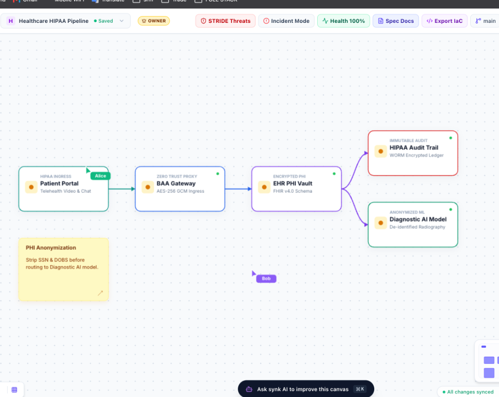
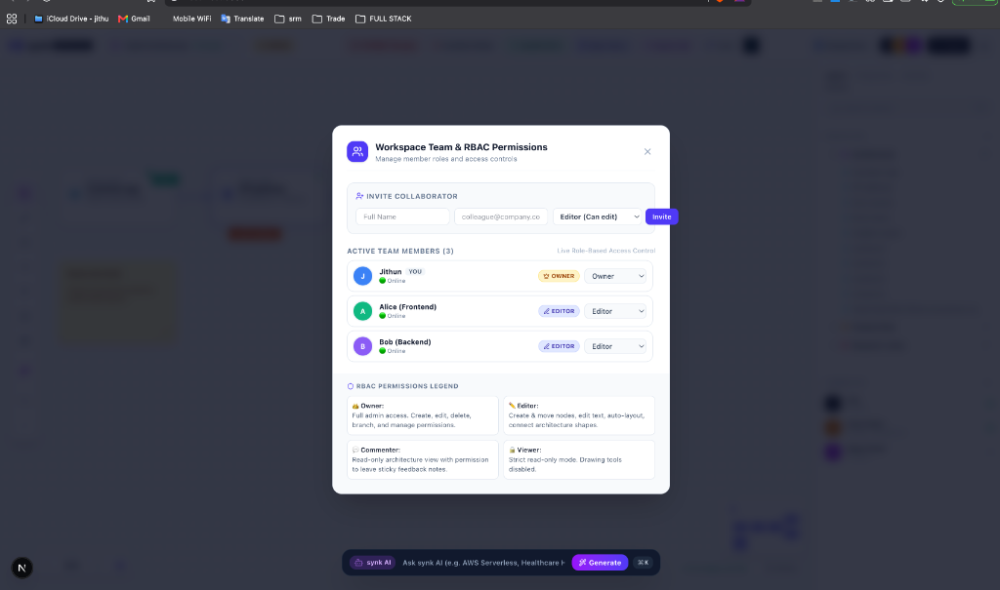
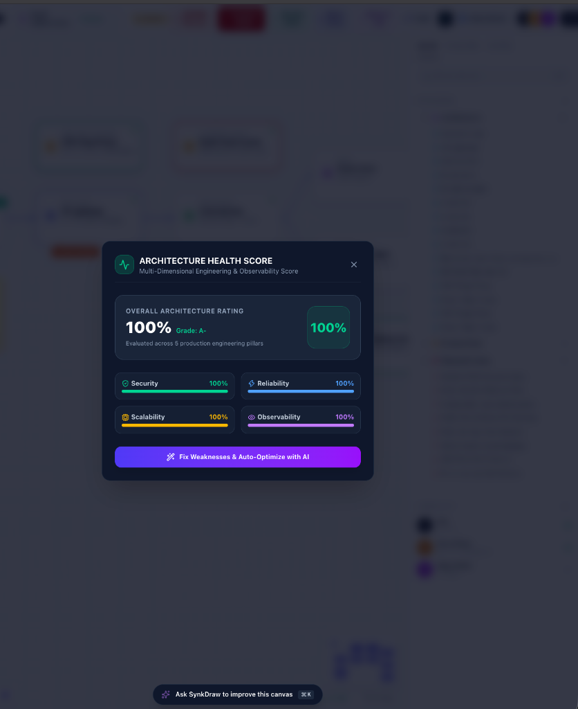
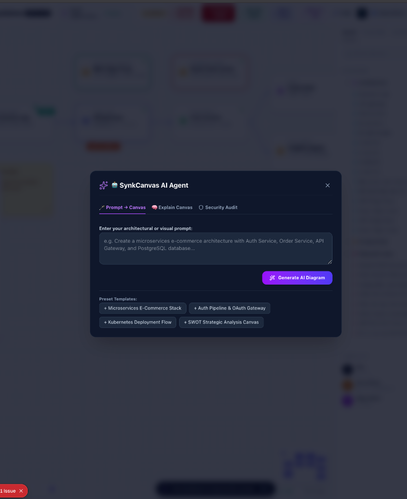
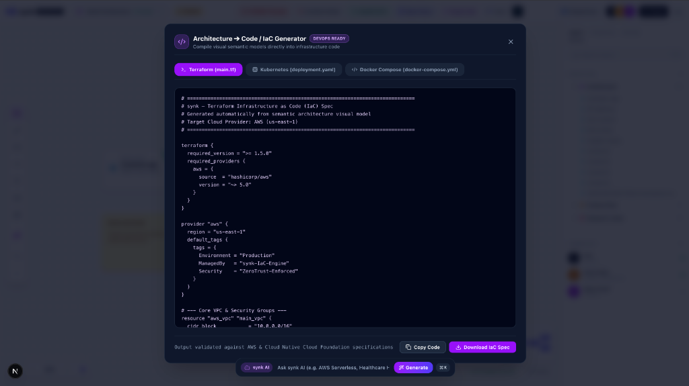

# synk — Enterprise Collaborative Engineering Intelligence Platform

Real-Time Collaborative Drawing Canvas

**Live Production Platform**: [https://synk-sigma.vercel.app/](https://synk-sigma.vercel.app/)

Synk is an enterprise-grade collaborative engineering and cybersecurity architecture platform designed for software architects, DevOps engineers, and security teams. It transforms technical documentation from static visual diagrams into an active, version-controlled directed acyclic graph (DAG) powered by Conflict-Free Replicated Data Types (CRDTs), automated STRIDE threat modeling, and Infrastructure as Code (IaC) compilation.

---

## Table of Contents

- [1. Platform Architecture & Overview](#1-platform-architecture--overview)
- [2. Visual Platform Showcase](#2-visual-platform-showcase)
- [3. In-Depth Feature Architecture & Workflows](#3-in-depth-feature-architecture--workflows)
  - [3.1 Distributed Canvas Git & 3-Way CRDT Graph Merge Engine](#31-distributed-canvas-git--3-way-crdt-graph-merge-engine)
  - [3.2 Automated STRIDE Cybersecurity Threat Scanner](#32-automated-stride-cybersecurity-threat-scanner)
  - [3.3 Live Incident Response & Automated Failover Provisioning](#33-live-incident-response--automated-failover-provisioning)
  - [3.4 Multi-Dimensional Architecture Health Index (0-100%)](#34-multi-dimensional-architecture-health-index-0-100)
  - [3.5 Infrastructure as Code (IaC) & Specification Compiler](#35-infrastructure-as-code-iac--specification-compiler)
  - [3.6 DevOps Toolchain & Enterprise Integrations](#36-devops-toolchain--enterprise-integrations)
  - [3.7 Interactive AI System Architecture Assistant](#37-interactive-ai-system-architecture-assistant)
  - [3.8 Enterprise Team Governance & Role-Based Access Control (RBAC)](#38-enterprise-team-governance--role-based-access-control-rbac)
- [4. Codebase Architecture & File Structure](#4-codebase-architecture--file-structure)
- [5. Quick Start & Local Setup Guide](#5-quick-start--local-setup-guide)
- [6. Production Deployment on Vercel](#6-production-deployment-on-vercel)
- [7. Competitive Feature Comparison Matrix](#7-competitive-feature-comparison-matrix)
- [8. License](#8-license)

---

## 1. Platform Architecture & Overview

Synk is a high-performance, real-time engineering platform that unifies architectural system design, threat modeling, version control, and cloud infrastructure deployment into a single browser-based workspace.

Unlike conventional visual whiteboards that store unstructured pixel representations, Synk models system architecture as a directed acyclic graph (DAG) of typed semantic nodes. Every component (such as API Gateways, Microservices, Databases, Caches, and Message Queues) maintains metadata regarding operational state, network trust boundaries, security compliance policies, and ownership credentials.

```
+-----------------------------------------------------------------------------------+
|                                 SYN K PLATFORM                                    |
|                                                                                   |
|  +-----------------------+     +-----------------------+     +-----------------+  |
|  |   REACT 19 CANVAS UI  | <-> | ZUSTAND GRAPH ENGINE  | <-> |  CRDT ENGINE    |  |
|  +-----------------------+     +-----------------------+     +-----------------+  |
|              |                             |                          |           |
|              v                             v                          v           |
|  +-----------------------+     +-----------------------+     +-----------------+  |
|  | STRIDE THREAT ENGINE  |     | IAC COMPILER (TF/K8S) |     | SYN K AI AGENT  |  |
|  +-----------------------+     +-----------------------+     +-----------------+  |
+-----------------------------------------------------------------------------------+
```

---

## 2. Visual Platform Showcase

### 1. System Architecture Canvas Interface


### 2. Workspace Team & Role-Based Access Control (RBAC)


### 3. Architectural Health Score & AI Auto-Optimization


### 4. Technical Architecture Specification Generator


### 5. Architecture to Code / IaC Compiler


---

## 3. In-Depth Feature Architecture & Workflows

### 3.1 Distributed Canvas Git & 3-Way CRDT Graph Merge Engine

Synk implements distributed version control directly on visual node graphs using Conflict-Free Replicated Data Types (CRDTs).

```
                      [ Base Architecture (main) ]
                                   |
                  +----------------+----------------+
                  |                                 |
                  v                                 v
     [ Feature Branch A (auth-v2) ]    [ Feature Branch B (redis) ]
                  |                                 |
                  +----------------+----------------+
                                   |
                                   v
                      [ 3-Way CRDT Merged Graph ]
```

#### Technical Operation:
1. **Branching**: Creating a branch clones the active graph state and assigns a unique vector clock namespace.
2. **Vector Clock Resolution**: Every object mutation (node position, label change, connector attachment) increments a logical clock vector.
3. **3-Way Merging**: When merging source branch `B` into target branch `A`, `CRDTEngine.threeWayMerge` evaluates:
   - Base Version: Common ancestor state.
   - Source Version: Modifications made in branch `B`.
   - Target Version: Current state of branch `A`.
4. **Visual Diff Preview**: Before merging, Synk calculates structural deltas and displays a real-time count of added nodes, updated attributes, and removed connectors.

---

### 3.2 Automated STRIDE Cybersecurity Threat Scanner

The security engine evaluates active graph topologies against the SIX core STRIDE threat categories:

```
+-----------------------------------------------------------------------------------+
|                         STRIDE THREAT ANALYSIS PIPELINE                           |
|                                                                                   |
|  [ Topology Graph ] ---> ( Edge Classifier ) ---> ( STRIDE Rule Auditor )          |
|                                                               |                   |
|                                                               v                   |
|  [ 1-Click Auto Fix ] <--- ( Vulnerability Matrix ) <--- ( Severity Ranker )      |
+-----------------------------------------------------------------------------------+
```

#### Threat Categories Evaluated:
- **Spoofing**: Unauthenticated entry points lacking gateway isolation.
- **Tampering**: Inter-service communications transmitting unencrypted traffic across trust boundaries.
- **Repudiation**: Database nodes missing immutable WORM audit trails.
- **Information Disclosure**: Unencrypted persistence layers lacking AES-256 storage encryption.
- **Denial of Service**: API gateways operating without rate-limiting middleware.
- **Elevation of Privilege**: Overly permissive IAM role bindings and missing proxy subnets.

#### Automated Remediation:
Clicking **Fix Issue** automatically injects missing security controls (such as TLS proxies, tokenization vaults, or private subnets) into the live graph.

---

### 3.3 Live Incident Response & Automated Failover Provisioning

When operational telemetry detects service degradation, Synk enters Incident Response Mode:

```
+-----------------------------------------------------------------------------------+
|                        INCIDENT RESPONSE WORKFLOW                                 |
|                                                                                   |
|  [ Telemetry Spike ] -> [ Red Alert Banner ] -> [ AI Root Cause Analysis ]       |
|                                                              |                    |
|                                                              v                    |
|  [ Resolved State (100%) ] <- [ Graph Auto-Injection ] <- [ 1-Click Mitigation ]  |
+-----------------------------------------------------------------------------------+
```

#### Workflow Steps:
1. **Telemetry Trigger**: High load or DB connection pool exhaustion triggers a top red alert banner.
2. **AI Diagnosis**: Opening the incident panel presents a root-cause breakdown (e.g., PostgreSQL connection pool exhaustion).
3. **Automated Mitigation Execution**: Clicking **Execute 1-Click Mitigation** automatically provisions multi-AZ PostgreSQL Failover Read Replicas onto the canvas graph, stabilizes database query capacity, and returns the workspace to normal state.

---

### 3.4 Multi-Dimensional Architecture Health Index (0-100%)

Synk calculates an aggregate health grade evaluated across four operational pillars:

$$\text{Health Score} = 0.35(\text{Security}) + 0.25(\text{Reliability}) + 0.20(\text{Scalability}) + 0.20(\text{Observability})$$

```
+-----------------------------------------------------------------------------------+
|                           HEALTH OPTIMIZATION FLOW                                |
|                                                                                   |
|  [ Current Score: 84% ] ---> [ Gap Detection: Missing Redis Flash Cache ]          |
|                                          |                                        |
|                                          v                                        |
|  [ Perfect Score: 100% ] <--- [ 1-Click AI Auto-Optimizer Injects Redis Node ]    |
+-----------------------------------------------------------------------------------+
```

#### 1-Click Optimization:
Clicking **Fix Weaknesses & Auto-Optimize with AI** automatically injects missing architectural patterns (such as WAF Edge Proxies or Redis Session Caches) onto the canvas graph to achieve a 100% health score.

---

### 3.5 Infrastructure as Code (IaC) & Specification Compiler

Synk parses visual topology graphs and compiles valid, production-ready infrastructure code:

```
+-----------------------------------------------------------------------------------+
|                             IaC COMPILATION PIPELINE                              |
|                                                                                   |
|                                /---> [ Terraform HCL (main.tf) ]                  |
|  [ Visual Graph Model ] ------> |---> [ Kubernetes YAML (deployment.yaml) ]       |
|                                \---> [ Docker Compose (docker-compose.yml) ]      |
+-----------------------------------------------------------------------------------+
```

#### Export Formats:
- **Terraform HCL**: Generates AWS VPCs, Security Groups, ECS Tasks, RDS Instances, and ElastiCache clusters.
- **Kubernetes Manifests**: Generates k8s v1.28 Ingress rules, Deployments with HPA scaling policies, StatefulSets, and Services.
- **Docker Compose**: Generates multi-container orchestration manifests with health probes and volume mounts.
- **Specification Documentation**: Exports technical Markdown architecture reports and printable white-background PDF specs.

---

### 3.6 DevOps Toolchain & Enterprise Integrations

Synk features an interactive integration manager for DevOps toolchains:

| Service | Integration Function | Credentials Required |
| :--- | :--- | :--- |
| **AWS Cloud** | Live CloudWatch & VPC topology sync | Access Key ID, Secret Key, Region |
| **GitHub** | Bi-directional architecture sync & PR checks | Personal Access Token, Org/Repo |
| **Slack** | Real-time security alert webhooks | Incoming Webhook URL, Channel |
| **Jira Software** | Object to issue syncing | Domain, API Token, Project Key |
| **Kubernetes** | Istio & K8s cluster state sync | API Endpoint, Kubeconfig Token |
| **Terraform Cloud** | Automated state file locking & plan | API Token, Workspace Name |

All credentials are saved securely via a 256-bit encrypted credential vault dialog.

---

### 3.7 Interactive AI System Architecture Assistant

Synk includes an AI Assistant that synthesizes complete architecture diagrams from natural language prompts:

```
+-----------------------------------------------------------------------------------+
|                            AI GENERATION ENGINE                                   |
|                                                                                   |
|  [ Text Prompt ] ---> [ Prompt Classifier ] ---> [ Node Generator ]               |
|                                                         |                         |
|                                                         v                         |
|  [ Clean Canvas ] <--- [ Viewport Centering ] <--- [ DAG Auto-Layout Engine ]     |
+-----------------------------------------------------------------------------------+
```

#### Collision-Free DAG Auto-Layout:
When generating or merging AI diagrams, Synk passes all nodes through `arrangeDAGLayout` to prevent overlapping:
- **Level 0 (Entry Point)**: Web/Mobile Clients ($x = 100$)
- **Level 1 (Edge Layer)**: Gateways & Proxies ($x = 370$)
- **Level 2 (Application Layer)**: Microservices & Core Logic ($x = 640$)
- **Level 3 (Data Layer)**: Databases, Caches & Event Stores ($x = 910$)
- **Vertical Spacing**: Each node in a level receives a distinct row index ($y = 160 + \text{idx} \times 135$), ensuring zero card collisions.

---

### 3.8 Enterprise Team Governance & Role-Based Access Control (RBAC)

Synk enforces strict Role-Based Access Control for team collaboration:

| Role | Permissions |
| :--- | :--- |
| **Owner** | Full admin access. Create, edit, delete, branch, run AI, and manage team roles. |
| **Editor** | Create & move nodes, edit text, run auto-layout, connect architecture shapes. |
| **Commenter** | Read-only architecture view with permission to leave sticky feedback notes. |
| **Viewer** | Strict read-only mode. All drawing tools and modification features disabled. |

---

## 4. Codebase Architecture & File Structure

```
fmj/
├── public/
│   └── screenshots/          # Embedded production showcase screenshots
├── src/
│   ├── app/                  # Next.js 16 App Router pages & API routes
│   │   ├── api/
│   │   │   ├── ai/           # AI diagram synthesis API route
│   │   │   └── canvas/       # Snapshot persistence API route
│   │   ├── layout.tsx        # App layout & metadata
│   │   └── page.tsx          # Main application page
│   ├── components/
│   │   ├── ai/               # AI Agent Modal & Interactive Floating Bar
│   │   ├── analytics/        # Audit Log & Observability Modals
│   │   ├── canvas/           # Canvas Engine (Vector render pipeline)
│   │   ├── docs/             # Spec Document Generator Modal
│   │   ├── git/              # Canvas Git Branching & 3-Way Merge Modal
│   │   ├── health/           # Architectural Health Score Modal
│   │   ├── iac/              # Infrastructure as Code Export Modal
│   │   ├── incident/         # Incident Response Alert Banner
│   │   ├── integrations/     # Toolchain Integration & SaaS Pricing Modal
│   │   ├── team/             # Workspace Team & RBAC Permissions Modal
│   │   ├── threat/           # STRIDE Threat Modeling Drawer
│   │   └── toolbar/          # Top Navbar, Main Toolbar & Properties Panel
│   ├── lib/
│   │   ├── ai.ts             # Semantic AI Architecture Generator & Parser
│   │   ├── autoLayout.ts     # Collision-free DAG layout algorithm
│   │   ├── codeGen.ts        # Terraform, K8s & Docker Compose compilers
│   │   ├── crdt.ts           # 3-Way CRDT Merge & Vector Clock Engine
│   │   ├── threatEngine.ts   # STRIDE threat scanner & mitigation rules
│   │   └── websocket.ts      # Real-time WebSocket multi-user client
│   ├── store/
│   │   └── canvasStore.ts    # Central Zustand state store & CRDT event log
│   └── types/
│       └── canvas.ts         # TypeScript definitions for graph objects
├── .env.local                # Local environment configuration
├── next.config.ts            # Next.js configuration
├── package.json              # Dependencies & build scripts
└── README.md                 # Project documentation
```

---

## 5. Quick Start & Local Setup Guide

### System Requirements
- Node.js 18.0.0 or higher
- npm 9.0.0 or higher

### Step-by-Step Local Setup

1. Clone the repository:
```bash
git clone https://github.com/Jithun02/synk.git
cd synk
```

2. Install project dependencies:
```bash
npm install
```

3. Configure Environment Variables (Optional):
Create or edit `.env.local` in the project root to enable external Gemini API integration:
```env
GEMINI_API_KEY=your_google_gemini_api_key_here
```
Note: If no API key is specified, Synk operates out of the box using its built-in local AI engine.

4. Launch the development server:
```bash
npm run dev
```

5. Access the application:
Open your browser and navigate to `http://localhost:3000`.

---

## 6. Production Deployment on Vercel

1. Commit and push your code to GitHub:
```bash
git init
git branch -M main
git add .
git commit -m "synk"
git remote add origin https://github.com/Jithun02/synk.git
git push -u origin main --force
```

2. Log into [Vercel](https://vercel.com/new) and import your `synk` repository.
3. Configure Environment Variables if applicable (`GEMINI_API_KEY`).
4. Click **Deploy**. Vercel will build and host your production environment automatically.

---

## 7. Competitive Feature Comparison Matrix

| Feature | Generic Whiteboards (Miro, Excalidraw) | Synk Enterprise Platform |
| :--- | :--- | :--- |
| **Core Data Model** | Unstructured vector graphics | Typed semantic directed acyclic graph |
| **Version Control** | Basic linear undo/redo history | 3-Way CRDT Git branching & merging |
| **Security Intelligence** | Manual visual sticky notes | Automated STRIDE threat vector analysis |
| **Code Compilation** | Static image exports | Terraform HCL, K8s YAML, Docker Compose |
| **Incident Response** | None | AI root-cause diagnosis & failover auto-provisioning |
| **Graph Layout** | Manual drag and drop | Bounding-box collision-free DAG auto-layout |
| **Team Governance** | Basic view/edit toggle | Granular RBAC (Owner, Editor, Commenter, Viewer) |

---

## 8. License

Distributed under the MIT License. See `LICENSE` for details.
