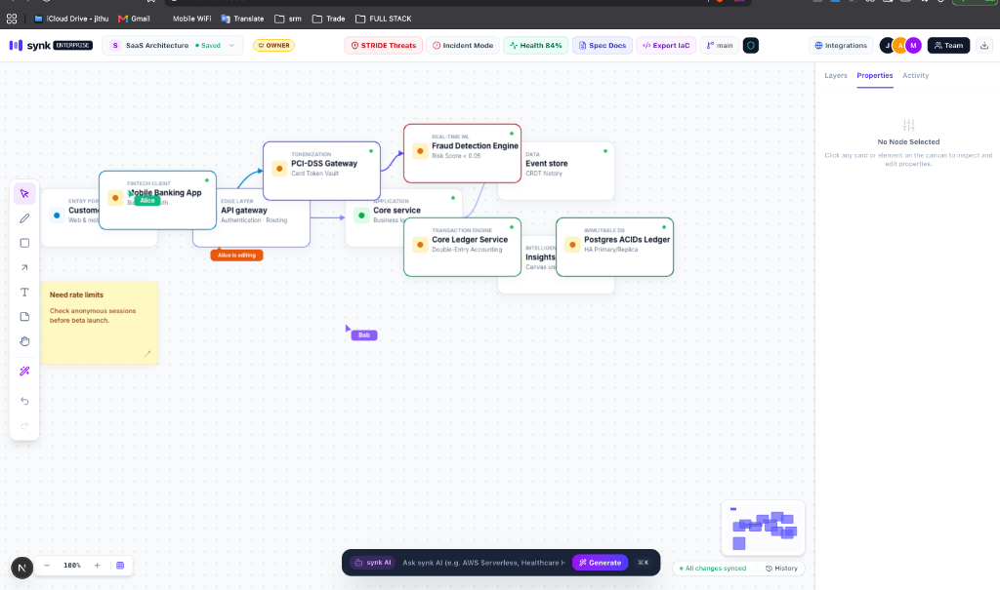

# synk — Enterprise Collaborative Engineering Intelligence Platform

Synk is a real-time collaborative engineering and cybersecurity architecture platform designed for software architects, DevOps engineers, and security teams. It transitions technical documentation from static diagrams into an active, version-controlled visual graph powered by Conflict-Free Replicated Data Types (CRDTs), automated STRIDE threat modeling, and Infrastructure as Code (IaC) generation.

---

## Executive Overview

Modern enterprise systems require continuous synchronization between architecture design, security compliance, and cloud infrastructure deployment. Traditional diagramming tools store static pixel data without semantic awareness. 

Synk treats every architectural component as a typed object node within a distributed directed acyclic graph (DAG). This enables visual version control, automated security vulnerability scanning, real-time multi-user collaboration, and instant compilation to Terraform HCL, Kubernetes manifests, and Docker Compose configurations.

---

## Visual Demonstration

### System Architecture Canvas Interface


### Workspace Team & Role-Based Access Control (RBAC)


### Collision-Free Merged Workspace Layout


---

## Core Enterprise Features

### 1. Canvas Git & 3-Way CRDT Merge Engine
- Distributed Version Control: Branch, commit, preview diffs, and merge visual node graphs using a 3-way Conflict-Free Replicated Data Type (CRDT) engine.
- Vector Clock Resolution: Automatically resolves concurrent node modifications and connector layout changes across multiple user sessions without data loss.
- Visual Diff Preview: Displays real-time delta indicators (+ Added Nodes, Modified Properties, Deleted Elements) before confirming branch integrations.

### 2. STRIDE Cybersecurity Threat Modeling
- Threat Vector Scanner: Evaluates architecture graphs against the STRIDE security framework (Spoofing, Tampering, Repudiation, Information Disclosure, Denial of Service, Elevation of Privilege).
- Automated Remediation: Recommends and executes 1-click security mitigations, such as injecting TLS proxies, upgrading database encryption, or establishing isolated private subnets.

### 3. Incident Response & 1-Click Mitigation
- Root Cause AI Diagnosis: Analyzes active system telemetry anomalies (e.g., PostgreSQL connection pool exhaustion or high latency spikes).
- Auto-Provisioning Mitigation: Automatically provisions failover read replicas or load balancer nodes directly onto the graph to restore system stability.

### 4. Architectural Health Score & Auto-Optimizer
- Quality Index (0-100%): Evaluates system resiliency, redundancy, zero-trust perimeter boundaries, and caching layers.
- One-Click Optimization: Automatically places Web Application Firewalls (WAF) and Redis session caches to achieve 100% compliance.

### 5. Infrastructure as Code (IaC) Generator
- Multi-Target Compilation: Exports valid, production-ready code directly from the visual canvas:
  - Terraform HCL (AWS VPC, Security Groups, ECS, RDS, ElastiCache)
  - Kubernetes YAML Manifests (v1.28 Ingress, Deployments, Services, StatefulSets)
  - Docker Compose (Production multi-container orchestration)
- Executive PDF Documentation: Generates white-background technical specification documents with component matrices and security compliance logs.

### 6. Interactive DevOps Toolchain Integrations
- Enterprise Integrations: Connects directly with AWS Cloud, GitHub, Slack, Jira Software, Kubernetes, and Terraform Cloud.
- Encrypted Credential Vault: Secure modal input for API keys, AWS Access Key IDs, Slack Webhooks, and Kubeconfig tokens.

### 7. AI System Architecture Assistant
- Semantic Prompt Classifier: Synthesizes production-ready visual architecture graphs from plain text prompts (e.g., Healthcare HIPAA Pipelines, AWS Serverless Stacks, Fintech Payment Gateways, and K8s Deployments).
- Automatic DAG Layout: Organizes nodes into non-overlapping architectural layers (Entry Point -> Edge Layer -> Application -> Data Storage) with auto-anchored connector paths.
- Viewport Auto-Centering: Resets zoom and pan coordinates automatically to focus on newly generated architecture components.

---

## Technology Stack

- Core Framework: Next.js 16 (App Router & Turbopack)
- User Interface: React 19, TypeScript (Strict Mode), TailwindCSS
- Render Engine: HTML5 Canvas API with custom high-performance vector rendering pipeline
- State Engine: Zustand with event-sourced CRDT history log
- Version Control Engine: Custom 3-Way Graph Merge Controller
- AI Synthesis: Built-in semantic parser with optional Google Gemini API (`gemini-1.5-flash`) integration

---

## Getting Started

### Prerequisites

Ensure you have Node.js 18.0 or later installed on your system.

```bash
node -v
npm -v
```

### Installation

1. Clone the repository:
```bash
git clone https://github.com/Jithun02/synk.git
cd synk
```

2. Install dependencies:
```bash
npm install
```

3. Configure Environment Variables (Optional):
Create a `.env.local` file in the root directory if you wish to connect an external Google Gemini API key:
```env
GEMINI_API_KEY=your_google_gemini_api_key_here
```
Note: If no API key is specified, Synk automatically uses its built-in local AI engine.

4. Run the development server:
```bash
npm run dev
```

5. Open your browser and navigate to:
```
http://localhost:3000
```

---

## Production Deployment on Vercel

1. Push your repository to GitHub:
```bash
git init
git branch -M main
git add .
git commit -m "synk"
git remote add origin https://github.com/Jithun02/synk.git
git push -u origin main
```

2. Import the project on [Vercel](https://vercel.com/new).
3. Add environment variables if required (`GEMINI_API_KEY`).
4. Deploy the application.

---

## Key Differentiators

| Feature | Generic Whiteboards (Miro, Excalidraw) | Synk Enterprise Platform |
| :--- | :--- | :--- |
| Data Model | Unstructured vector graphics | Typed semantic node graph |
| Version Control | Basic undo/redo history | 3-Way CRDT Git branching & merging |
| Security | Manual visual notes | Automated STRIDE threat analysis |
| Code Export | Image export only | Terraform, Kubernetes, & Docker Compose |
| Incident Response | None | AI root-cause diagnosis & 1-click mitigation |
| System Layout | Manual drag and drop | Bounding-box collision-free DAG auto-layout |

---

## License

Distributed under the MIT License. See `LICENSE` for details.
